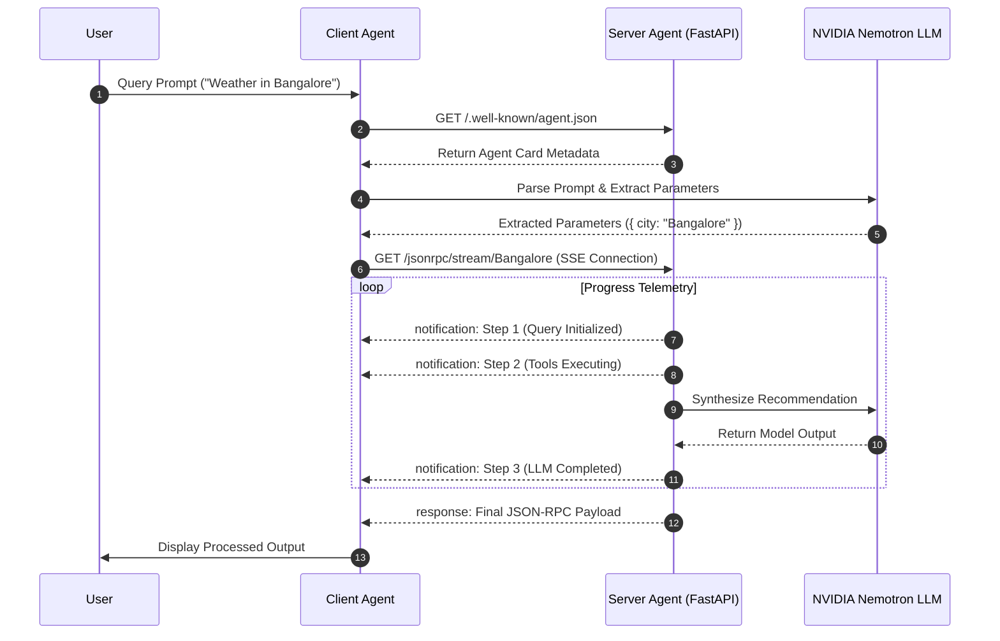

# Agent2Agent (A2A) Protocol Implementation

A Python reference implementation for Agent-to-Agent (A2A) inter-agent communication. This repository demonstrates standard patterns for service discovery via Agent Cards, structured interaction over JSON-RPC 2.0, real-time progress streaming using Server-Sent Events (SSE), and LLM reasoning integration.

---

## Table of Contents

- [Overview](#overview)
- [Key Features](#key-features)
- [Architecture](#architecture)
- [Project Structure](#project-structure)
- [Installation & Setup](#installation--setup)
- [Configuration](#configuration)
- [Usage](#usage)
  - [Starting the Server Agent](#starting-the-server-agent)
  - [Running the Client Agent](#running-the-client-agent)
- [API Reference](#api-reference)
  - [Agent Discovery](#agent-discovery-endpoint)
  - [JSON-RPC Endpoint](#json-rpc-20-endpoint)
  - [SSE Streaming Endpoint](#sse-progress-streaming-endpoint)
  - [Registered Methods](#registered-rpc-methods)
- [Communication Protocol Comparison](#communication-protocol-comparison)

---

## Overview

In multi-agent architectures, agents require structured mechanisms to negotiate capabilities, delegate tasks, and return intermediate status updates. This framework provides an end-to-end working model covering four primary communication primitives:

1. **Discovery**: Agents query `/.well-known/agent.json` (the Agent Card) to discover available endpoints, parameters, and tool interfaces dynamically.
2. **RPC Requests**: Standardized JSON-RPC 2.0 request/response exchanges over HTTP POST for synchronous tool execution.
3. **Telemetry & Streaming**: Progress updates pushed step-by-step to the client using Server-Sent Events (SSE).
4. **LLM Synthesis**: Server-side tool execution combined with LLM inference (NVIDIA Nemotron via OpenAI-compatible SDK) to resolve complex user prompts.

---

## Key Features

- **Standardized Discovery**: Dynamic capability publication via `/.well-known/agent.json`.
- **JSON-RPC 2.0 Specification**: Native support for request framing, method routing, parameter binding, and standard error responses.
- **Progress Streaming**: Real-time event streaming over SSE (`jsonrpc_notification`) to track background task states.
- **Client Parameter Extraction**: LLM-assisted prompt parsing on the client to extract target arguments prior to RPC calls.
- **Graceful Fallbacks**: Automated fallback logic when LLM credentials are not configured or external services time out.
- **Educational Guide**: Includes `simple_a2a_learning_guide.md` explaining core A2A messaging patterns.

---

## Architecture



---

## Project Structure

```text
.
├── client/
│   └── client.py                  # Client Agent CLI and streaming runtime
├── server/
│   └── server_agent.py            # FastAPI Server Agent (RPC, SSE, Discovery)
├── .env                           # Environment configuration
├── requirements.txt               # Dependencies
└── simple_a2a_learning_guide.md   # Conceptual reference manual
```

---

## Installation & Setup

### Prerequisites

- Python 3.8+
- `pip` package manager

### Environment Setup

1. **Clone the repository and enter the directory**:
   ```bash
   cd Agent2Agent
   ```

2. **Create a virtual environment**:
   ```bash
   python -m venv .venv
   source .venv/bin/activate   # Linux/macOS
   # .venv\Scripts\activate    # Windows
   ```

3. **Install dependencies**:
   ```bash
   pip install -r requirements.txt
   ```

---

## Configuration

Create a `.env` file in the root directory:

```env
base_url="https://integrate.api.nvidia.com/v1"
nemotron_api_key="YOUR_NVIDIA_API_KEY"
model="nvidia/nemotron-3-ultra-550b-a55b"
```

If `nemotron_api_key` is omitted, both client and server components will automatically use mock fallback handlers.

---

## Usage

### Starting the Server Agent

Run the FastAPI server using Uvicorn:

```bash
uvicorn server.server_agent:app --host 0.0.0.0 --port 8000 --reload
```

The server runs on `http://localhost:8000`. OpenAPI documentation is available at `http://localhost:8000/docs`.

### Running the Client Agent

Execute a query using the client CLI:

```bash
python client/client.py "What is the weather in Bangalore and what should I wear?"
```

#### Console Output Example

```text
AUTONOMOUS CLIENT AGENT INITIALIZING (RESPONSE STREAMING MODE ONLY)
----------------------------------------------------------------------
User Request: "What is the weather in Bangalore and what should I wear?"
[CLIENT AGENT] Discovering Server Agent at http://localhost:8000/.well-known/agent.json...
[CLIENT AGENT] Agent Discovery successful.

[CLIENT AGENT LLM] Reasoning over user query to extract city...
[CLIENT AGENT LLM DECISION] Extracted Target City: 'Bangalore'

[CLIENT AGENT -> SERVER AGENT] Connecting to Response Streaming Endpoint:
   GET http://localhost:8000/jsonrpc/stream/Bangalore

[Stream Notification - Step 1] Initiating JSON-RPC agent query for Bangalore...
[Stream Notification - Step 2] Executing weather metric tools for Bangalore...
[Stream Notification - Step 3] Running NVIDIA Nemotron LLM recommendation model...

[SERVER AGENT -> CLIENT AGENT] Stream Finished! Final Payload Received:
{
  "jsonrpc": "2.0",
  "result": {
    "task_status": "COMPLETED",
    "city": "Bangalore",
    "weather_data": {
      "city": "Bangalore",
      "temperature": "26°C",
      "condition": "Partly Cloudy",
      "humidity": "62%",
      "wind_speed": "12 km/h"
    },
    "agent_reasoning": "For Bangalore's 26°C weather, lightweight cotton apparel is recommended.",
    "model_used": "nvidia/nemotron-3-ultra-550b-a55b"
  },
  "id": "stream-req-1"
}

BEAUTIFUL A2A STREAMING EXECUTION LOG
----------------------------------------------------------------------
Original User Query : "What is the weather in Bangalore and what should I wear?"
Endpoint Called     : GET /jsonrpc/stream/Bangalore
Stream Status        : COMPLETED
Target City          : Bangalore
Weather Metrics      :
   - Temperature     : 26°C
   - Condition       : Partly Cloudy
   - Humidity        : 62%
   - Wind Speed      : 12 km/h

SERVER AGENT REASONING & AI RECOMMENDATION:
   For Bangalore's 26°C weather, lightweight cotton apparel is recommended.
----------------------------------------------------------------------
```

---

## API Reference

### Agent Discovery Endpoint

- **Endpoint**: `GET /.well-known/agent.json`
- **Description**: Returns Agent Card containing protocol capabilities, available methods, and schema specifications.

<details>
<summary>View Sample Agent Card JSON</summary>

```json
{
  "name": "NVIDIANemotronWeatherAgent",
  "description": "Agent-to-Agent weather provider powered by NVIDIA Nemotron & JSON-RPC 2.0.",
  "version": "1.0.0",
  "protocol": "JSON-RPC 2.0",
  "llm_model": "nvidia/nemotron-3-ultra-550b-a55b",
  "capabilities": {
    "jsonrpc_endpoint": {
      "endpoint": "/jsonrpc",
      "method": "POST"
    },
    "jsonrpc_sse_stream": {
      "endpoint": "/jsonrpc/stream/{city}",
      "method": "GET"
    }
  },
  "available_tools": [
    {
      "name": "ask_agent",
      "description": "Executes weather tools and synthesizes LLM recommendation",
      "params": { "query": "string", "city": "string (optional)" }
    },
    {
      "name": "get_weather",
      "description": "Get real-time weather metrics for a city",
      "params": { "city": "string" }
    },
    {
      "name": "get_forecast",
      "description": "Get multi-day weather forecast for a city",
      "params": { "city": "string", "days": "integer (optional)" }
    },
    {
      "name": "ask_llm",
      "description": "Queries LLM directly",
      "params": { "prompt": "string" }
    }
  ]
}
```
</details>

---

### JSON-RPC 2.0 Endpoint

- **Endpoint**: `POST /jsonrpc`
- **Header**: `Content-Type: application/json`

#### Request Payload
```json
{
  "jsonrpc": "2.0",
  "method": "ask_agent",
  "params": {
    "query": "What is the weather in Tokyo?",
    "city": "Tokyo"
  },
  "id": 1
}
```

#### Response Payload
```json
{
  "jsonrpc": "2.0",
  "result": {
    "task_status": "COMPLETED",
    "query": "What is the weather in Tokyo?",
    "city": "Tokyo",
    "tool_executed": "mock_get_weather",
    "weather_data": {
      "city": "Tokyo",
      "temperature": "22°C",
      "condition": "Clear Sky",
      "humidity": "50%",
      "wind_speed": "10 km/h"
    },
    "agent_reasoning": "Clear skies at 22°C in Tokyo call for light jackets or casual outdoor wear.",
    "model_used": "nvidia/nemotron-3-ultra-550b-a55b"
  },
  "id": 1
}
```

---

### SSE Progress Streaming Endpoint

- **Endpoint**: `GET /jsonrpc/stream/{city}`
- **Header**: `Accept: text/event-stream`
- **Behavior**: Streams intermediate `jsonrpc_notification` progress events over an open HTTP connection, followed by the final `jsonrpc_response` payload.

---

### Registered RPC Methods

| Method | Description | Parameters |
|---|---|---|
| `get_weather` | Returns current weather metrics for a city | `city` (string) |
| `get_forecast` | Returns a multi-day forecast | `city` (string), `days` (int, default: 3) |
| `ask_llm` | Directly queries the LLM | `prompt` (string) |
| `ask_agent` | Runs weather tools and synthesizes LLM response | `query` (string), `city` (optional string) |

---

## Communication Protocol Comparison

A detailed conceptual guide is available in [simple_a2a_learning_guide.md](simple_a2a_learning_guide.md).

| Pattern | Delivery | Ideal Use Case |
|---|---|---|
| **Synchronous RPC** | Single HTTP Request/Response | Short-lived query processing |
| **SSE Streaming** | Unidirectional HTTP Stream | Real-time task progress and step updates |
| **Webhooks** | Async HTTP Callback | Long-running asynchronous workflows |
